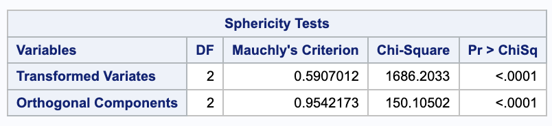
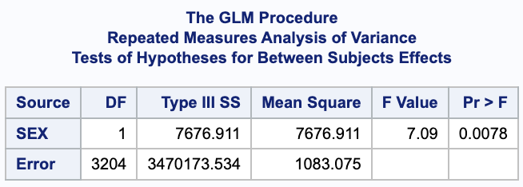
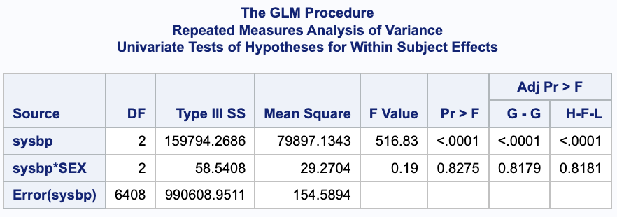
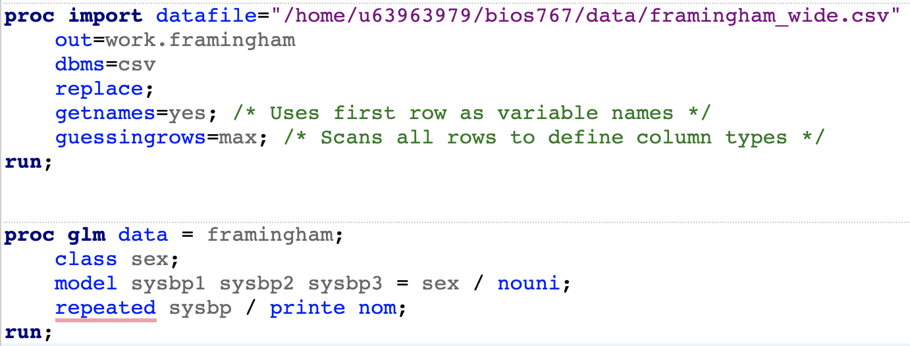

# Submission + Formatting Requirements
*delete this section before turning in*

Your submission should include:
• A written report addressing all parts above
• All relevant tables and figures embedded in your report
• Your SAS and/or R code as an appendix
• Selected output (not all raw output—select the relevant portions)

• Write as if preparing a report for a statistical consulting client
• Be specific with your interpretations—relate findings back to your actual variables and research
context
• Round test statistics and p-values appropriately (e.g., F = 4.23, p = 0.018)
• For very small p-values, report as p < 0.001

```{r, include = FALSE}
library(riskCommunicator)
library(ggplot2)
library(dplyr)
library(tidyr)
library(gt)
```


```{r, include = FALSE}
data(framingham)

# find patients who had 3 visits
three_visits <- framingham %>%
  count(RANDID, name = "n_obs") %>%
  filter(n_obs >= 3)

# only keep those with 3 visits
framingham2 <- framingham %>%
  semi_join(three_visits, by = "RANDID")


# get in wide format for SAS code
framingham_wide <- framingham2 %>%
  select(RANDID, SEX, PERIOD, SYSBP) %>%
  pivot_wider(
    id_cols = c(RANDID, SEX),
    names_from = PERIOD,
    values_from = SYSBP,
    names_prefix = "sysbp"
  ) %>%
  # only keep what we need
  select(RANDID, SEX, sysbp1, sysbp2, sysbp3)

write.csv(framingham, file = "framingham.csv", row.names = FALSE)
write.csv(framingham_wide, file = "framingham_wide.csv", row.names = FALSE)

```


# Descriptive Analysis 

*1. Descriptive statistics (Abbey):* Create a table presenting the mean and standard deviation of your continuous outcome at each time point, separately by group.

```{r, echo = FALSE}
tab_dat <- framingham2 %>%
  mutate(SEX = recode(as.character(SEX), `1` = "Male", `2` = "Female")) %>%
  group_by(PERIOD, SEX) %>%
  summarise(
    mean_sbp = mean(SYSBP, na.rm = TRUE),
    sd_sbp   = sd(SYSBP,   na.rm = TRUE),
    .groups = "drop"
  ) %>%
  pivot_wider(
    names_from  = SEX,
    values_from = c(mean_sbp, sd_sbp),
    names_glue  = "{SEX}_{.value}"
  )

tab_dat %>%
  gt() %>%
  tab_header(
    title = md("**Systolic Blood Pressure (mmHg) by Period and Sex**")) %>%
  tab_spanner(
    label = "Male",
    columns = c(`Male_mean_sbp`, `Male_sd_sbp`)) %>%
  tab_spanner(
    label = "Female",
    columns = c(`Female_mean_sbp`, `Female_sd_sbp`)) %>%
  cols_label(
    PERIOD = "Period",
    Male_mean_sbp   = "Mean",
    Male_sd_sbp     = "SD",
    Female_mean_sbp = "Mean",
    Female_sd_sbp   = "SD"
  ) %>%
  fmt_number(
    columns = -PERIOD,
    decimals = 1
  )
```


*2. Interaction plot (Sonia) :* Create a plot showing the mean response over time for each group. Based on your plot, comment on whether the profiles appear parallel and whether the groups appear to differ in their overall level

# Univariate Repeated Measures ANOVA - Abbey

*1. Sphericity assessment (10 points):* Assess whether the sphericity assumption is appropriate
for your data. Describe your findings and explain how they affect your approach to the within-
subject tests.

We used Mauchly's Test of Sphericity which tests if type H covariance structure is valid. After running this test in SAS, we got a p-value of $<.0001$ which tells us that this assumption is not valid for our dataset. To account for this, we will use the adjusted p-values for the within-subject tests.




*2. Hypothesis tests (20 points):* Test and interpret the following effects:
- Time effect: Is there evidence that the mean response changes over time?
- Group effect: Is there evidence that groups differ in their overall mean response?
- Group × Time interaction: Is there evidence that the groups have non-parallel profiles?

For each test, report the relevant test statistic and p-value, and interpret the result in the context
of your research question.

For the test of a time effect, we have an F-value of $516.83$ and an adjusted p-value of $<.0001$. We have statistically significant evidence that there is relationship between systolic blood pressure over time. This suggests that the lines are not horizontal (have a slope).

For the test of a sex effect, we have an F-value of $7.09$ and a p-value of $0.0078$. We have statistically significant evidence that there is a relationship between systolic blood pressure and sex. This suggests that males and females have distinct lines (not overlapping).

For the test of an interaction effect, we have an F-value of $0.19$ and an adjusted p-value of $0.8179$. We do not have evidence that there is an interaction effect between sex and time with relation to systolic blodd pressure. This suggests that the lines for sex are parallel.






# MANOVA - Sonia

*1. Test of parallelism (10 points):* Test whether the group profiles are parallel using MANOVA.
State what you found and what the result means for your research question.

*2. Test of group effect (10 points):* If appropriate based on your parallelism results, test
whether the groups have coincident profiles (i.e., same overall level). Explain why testing for
coincident profiles is or is not appropriate given your parallelism results.

*3. Test of time effect (10 points):* Test whether there is an overall time effect using MANOVA.
Compare the MANOVA time effect result to the univariate time effect result from Part 2.

# Comparison and Interpretation

*1. Comparison of approaches (Abbey):* Compare the results from the univariate and
MANOVA approaches. Did they lead to the same conclusions? If not, explain why the re-
sults may differ and which approach you consider more appropriate for your data.

*2. Scientific interpretation (Sonia):* Summarize your findings as you would for a collab-
orator. What did you learn about how your outcome changes over time and whether groups
differ?

*3. Limitations (Both):* Discuss at least two limitations of these classical approaches for your
dataset.


# Appendix





